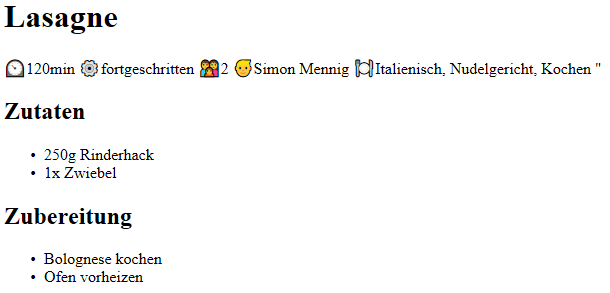

# Cooking-Recipe-DSL

A simple cooking recipe DSL (Domain Specific Language) to demonstrate scalas DSL capabilities
  
This was made during a course at the HTWG Constance.
  
## 1. Input
Let's say the user has the following recipe written in a textual file (german)

    Titel: Lasagne
    Dauer: 120min
    Personen: 2
    Autor: Simon Mennig
    Kategorien: Italienisch, Nudelgericht, Kochen
    Schwierigkeit: fortgeschritten
    Zutaten:
    > 250g Rinderhack
    > 1x Zwiebel
    Schritte:
    Bolognese kochen
    Ofen vorheizen

This is going to be parsed and converted.

## 2. Output
The output looks like this  

## Usage

    scala main.Main /path/to/my/recipe.txt
   
The converted recipe will automatically open up in your default browser.
